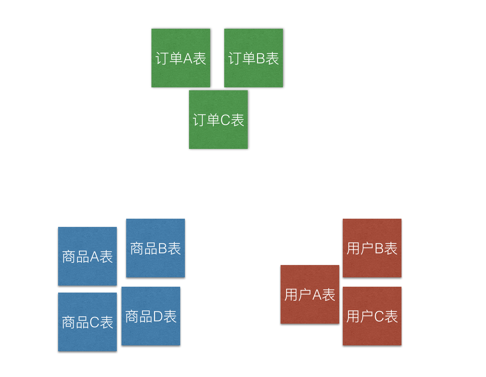
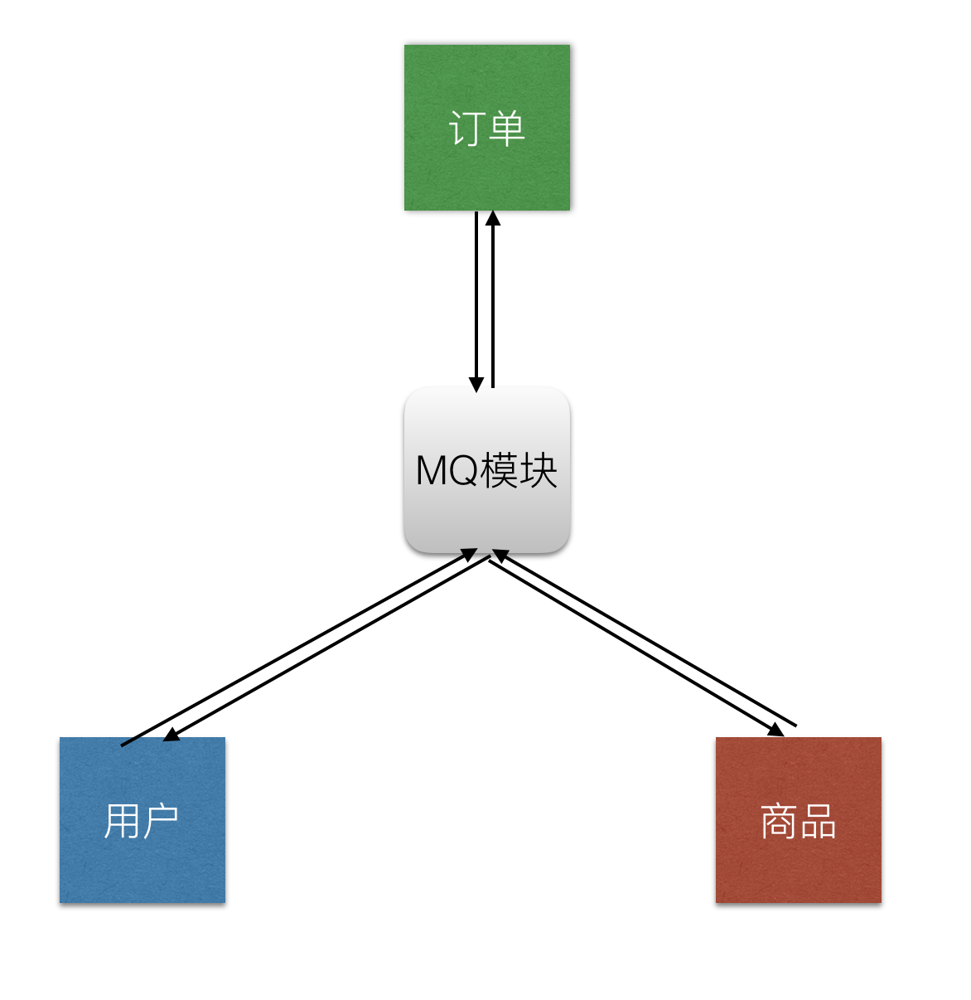

# 一种开发互联网项目的方式

### 前言
有人说现在一个互联网时代，也有人说现在是一个大数据时代。随着互联网的高速发展，对产品的要求越来越高。尽管现在技术也已经很成熟，但是很多刚开始接触互联网项目的团队却不知道如何下手。前两天我见了一名创业者，与他的公司技术负责人了解了一下他们的项目架构，觉得很有问题，但是他们已经开发了本年之久要想从根本解决问题已经不太容易了。关于mq_demo，就是想讲给即将要做互联网项目的团队或者刚开始做的团队。


### 个人履历
我12年底开始参加工作，开始是做手机端开发，后来转入java后端开发。偶然的一次机会我参与一个互联网项目开发，哪个时候我只是一个普通研发，我跟随同时一块研究探讨如何研发互联网项目。但是项目大概做了3个月就停掉了，由于商务原因没有继续研发。也就是在那时候我开始研究什么是大数据高并发。在14年底我辞掉了工作与朋友一块开始了创业之路，我们公司主要是做手机app项目。那也正是O2O流行的时候，在那段时间我们接触了很多创业者，他们都有一个互联网的产品，他们找到我们让我们帮他们实现。也是在这段经历中让我学会如何开发互联网项目。如今我已经是多家公司的技术顾问兼任两个公司的技术总监。 

### mq思想的由来
在去年阿里云开始邀请各互联网分享公司的技术框架，当时我记得小咖秀的技术总监讲过一句话，互联网的项目一定要做到可以拆分。mq本意是指消息中间件，被用于服务之间的消息数据通讯。但是在这里它不仅仅是指消息通讯又有了一层另外的含义。

### 如何拆分项目
我是计算机专业出生，记得当时大学上课的是时候，老师就在将划分项目模块。后来参加工作的时候我们也在划分模块，但是划分完以后觉得也没有什么，就感觉只是多了几个package，别无他用。如何拆分项目始终不是很清晰，在慢慢锻炼的过程中我发现了如何划分项目模块的方式，就是直接通过DB来划分项目模块。

#### 从数据库开始拆分模块
假设我们要做一个商城项目，假设商城有订单／商品／用户三个模块。那么我会直接在设计数据库的时候就将他们拆分成三个模块。表名会叫做：t_o_order／t_p_product／t_u_user。然后在设计他们的模块表时都会通过各个模块的表的表名前缀做区分，并且做到不让业务在做数据库查询的时候需要跨模块查询。若存在的话可能的原因有两种：1设计的模块不合理。2可以通过模块数据冗余的方式。其实设计完以后，可以达到的效果就是，完全可以让各个模块存放在不同的数据库下。



#### 如何拆分项目
当我们把数据库模块划分好了以后，项目模块划分就简单了。我们只需要配合着db来划分模块就行了，也就是将t_u_划分为一个模块，t_o_一个模块，t_p_一个模块。然后配套的dao service都放在一个模块下。

也就是如下效果：


#### 模块之前如何通讯
同一个项目，肯定无法避免项目内部模块之前的相互调用，比如下单接口，该接口必定会关联到用户以及商品模块。那么我们如何处理呢。若直接在订单模块调用商品或者用户模块，那么当项目需要拆分的时候就无法分离了，你会发现各个模块相互引用。


我们添加MQ概念后变成为：



模块之间的相互依赖变成了对mq模块的依赖。

那么我们来看一下创建订单功能是如何实现的,下面是创建订单业务方法的实现类

```$xslt

    @Autowired
    private MQUserService mqUserService;

    @Autowired
    private MQProductService mqProductService;

    @Autowired
    private OrderDao orderDao;

    @Override
    public Map<String, Object> createOrder(String json) throws ServiceException {
        int productId = JsonUtils.getInt(json,"productId",0);
        int userId = JsonUtils.getInt(json,"userId",0);
        //todo 检查商品库存

        Product product =  mqProductService.checkProductCount(productId);

        //todo 检查用户金额

        User user =  mqUserService.checkUserMoney(userId);

        //todo 组装订单数据
        Order order = null;


        //todo 创建订单
        orderDao.createOrder(order);

        Map<String, Object> res = new HashMap<>();
        res.put("order",order);
        res.put("product",product);
        res.put("user",user);

        return res;
    }
```
看一下mq模块的MQUserService和MQProductService的实现：

```$xslt
@Service
public class MQUserServiceImpl implements MQUserService {

    @Autowired
    private UserService userService;

    @Override
    public User checkUserMoney(int userId) throws ServiceException {
        return userService.checkUserMoney(userId);
    }
}


```

```$xslt
@Service
public class MQProductServiceImpl implements MQProductService {


    @Autowired
    private ProductService productService;

    @Override
    public Product checkProductCount(int productId) throws ServiceException {
        return productService.checkProductCount(productId);
    }
}

```

mq模块下的业务仅仅起到了调用的功能，没有具体的业务逻辑。

#### 这样设计MQ模块有什么意义

通过mq的概念我们轻松的降低模块之前的耦合，而且在项目的初期由于项目还未达不到需要划分模块的时候，此时完全可以在一个项目下，这样做到了将来可拆分的准备。其次就是对与软件开发维护上，a模块需要协调b模块的功能的时候，a模块只需要在b模块MQ的Service下添加一个自己需要业务接口就行了，然后通知b模块实现该接口即可。


### 从单机系统演变成为集群式系统

只要我们在设计指出就考虑到了如何拆分项目，那么当项目达到单机的瓶颈的时候，做拆分就简单了，这个时候只需要让mq模块的注入方式调用其他模块改成RPC调用即可。然后再添加对分布式事务的支持这样一个分布式集群系统就搭建好了。关于RPC远程调用可以使用阿里的[dubbo](http://dubbo.io/)框架，关于分布式事务可以采用我封装的[transaction](https://github.com/1991wangliang/transaction)框架.

分布式系统的架构图：


