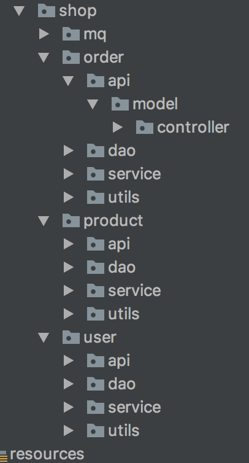
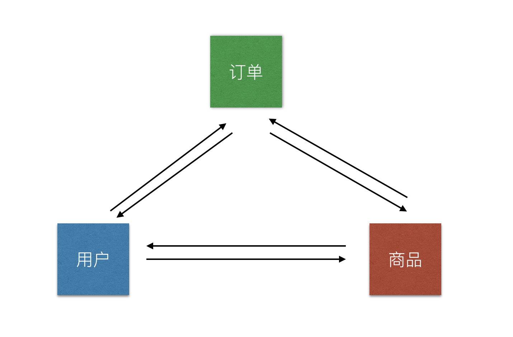
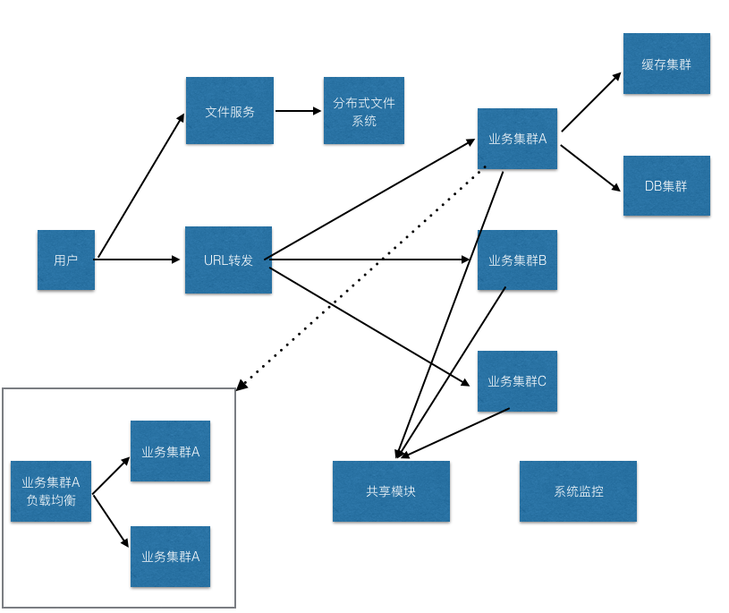

# 一种开发互联网项目的方式

### 前言
现在一个互联网时代，也是一个大数据时代。随着互联网的高速发展，对产品的要求越来越高。尽管现在IT技术也已经很成熟，但是还有很多刚开始接触互联网项目的团队却不知道如何下手。前两天我见了一名创业者，与他公司的技术负责人了解了一下他们的项目架构，觉得很有问题，但是他们已经开发了半年之久要想从根本解决问题已经不太容易了。关于mq思想，就是想讲给那些即将要做互联网项目或刚开始做的项目团队。


### 个人履历
我12年底开始参加工作，刚开始是做手机端开发，后来转入java后端开发。偶然的一次机会我参与一个互联网项目开发，当时我只是一个普通研发，跟随同事一块研究探讨如何研发互联网项目。但是项目大概做了3个月就停掉了，由于商务原因没有继续研发下去。也就是在那时候我决定开始研究到底什么是大数据，什么叫做高并发。在14年底我辞掉了工作与朋友一块开始了创业之路，我们公司主要是做手机app项目。那也正是O2O流行的时候，在那段时间我们接触了很多创业者，他们都有一个互联网的产品，他们找到我们让我们帮他们实现功能。也是在这段经历中让我学会如何开发互联网项目。

### mq思想的由来
在去年阿里云的技术分享会上，他们邀请各个互联网公司的技术大佬分享他们的技术框架，小咖秀的技术总监讲过一句话：“互联网的项目一定要做到可以拆分”。mq本意是指消息中间件，被用于服务之间的消息数据通讯。但是在这里它不仅仅是指消息通讯又有了一层另外的含义。

### 如何拆分项目
大学上课的是时候，老师就在讲做项目要划分项目模块，后来参加工作的时候我们也都划分了模块，但是划分完以后觉得也没有什么特别清晰的感觉，只是觉的多了几个package而已。如何拆分项目始终不是很清晰，在慢慢锻炼的过程中我发现了如何划分项目模块的方式，就是直接通过db来划分项目模块。

#### 从数据库设计就开始拆分模块
假设我们要做一个商城项目，商城有订单／商品／用户三个模块。那么我会直接在设计数据库的时候就将他们拆分成三个模块。表名会叫做：t_o_order／t_p_product／t_u_user。然后在设计他们模块下其他表时会通过模块的前缀名做区分。并且做到不让业务在实现功能的时候需要跨模块做数据库操作。若存在的话可能的原因有两种：1设计的模块不合理。2可以通过模块数据冗余的方式避免模块调用。设计完以后，可以达到的效果就是，完全可以让各个模块存放在不同的数据库下。


#### 如何拆分项目
当我们把数据库模块划分好了以后，项目模块划分就简单了。只需要配合着db来划分模块就行了，也就是将t_u_划分为一个模块，t_o_一个模块，t_p_一个模块。然后配套的dao service都放在一个模块下。
效果如下：


#### 模块之前如何通讯
同一个项目，肯定无法避免项目内部模块之间的相互调用，比如下单接口，该接口必定会关联到用户以及商品模块。那么我们如何处理呢。若直接在订单模块调用商品或者用户模块，那么有会导致项目模块高度耦合无法分离了。
如下：

所以我们添加mq模块：

模块之间的相互依赖变成了对mq模块的依赖。这样模块不会相互依赖了，但是却都依赖mq。但是mq模块的原则是这样的：1 mq模块不参与任何业务处理，只做模块之间的协调调用。2 mq模块下会有各个模块的业务调度类，每个业务类下暴漏出的方法，都是需要被其他模块调用的。

我们来看一段代码，学习一下mq如何工作的。这是一个下单的业务方法。方法里需要访问用户和商品模块，但是该业务下尽通过mq模块访问，而不直接访问模块。

```$xslt

    @Autowired
    private MQUserService mqUserService;

    @Autowired
    private MQProductService mqProductService;

    @Autowired
    private OrderDao orderDao;

    @Override
    public Map<String, Object> createOrder(String json) throws ServiceException {
        int productId = JsonUtils.getInt(json,"productId",0);
        int userId = JsonUtils.getInt(json,"userId",0);
        //todo 检查商品库存

        Product product =  mqProductService.checkProductCount(productId);

        //todo 检查用户金额

        User user =  mqUserService.checkUserMoney(userId);

        //todo 组装订单数据
        Order order = null;


        //todo 创建订单
        orderDao.createOrder(order);

        Map<String, Object> res = new HashMap<>();
        res.put("order",order);
        res.put("product",product);
        res.put("user",user);

        return res;
    }
```
再来看一下mq模块的MQUserService和MQProductService的实现：

```$xslt
@Service
public class MQUserServiceImpl implements MQUserService {

    @Autowired
    private UserService userService;

    @Override
    public User checkUserMoney(int userId) throws ServiceException {
        return userService.checkUserMoney(userId);
    }
}


```

```$xslt
@Service
public class MQProductServiceImpl implements MQProductService {


    @Autowired
    private ProductService productService;

    @Override
    public Product checkProductCount(int productId) throws ServiceException {
        return productService.checkProductCount(productId);
    }
}

```

mq模块下的业务实现仅仅起到了调用的功能，没有具体的业务逻辑。

#### 这样设计mq模块有什么意义

. 通过mq的概念我们轻松的降低模块之间的耦合.
. 简化了模块之间协作开发的难度。  
    若a模块需要协调b模块的功能的时候，a模块只需要在b模块mq下的模块Service下添加一个自己需要业务接口就行了，然后通知b模块实现该接口即可。
. 当需要做拆分项目的时候，只需要将mq模块替换成RPC即可。

这样的项目前期可以是在一个项目下，而且很好的解决了项目模块划分和配合的问题，再就是在项目的后期需要做拆分的时候。只需要调整一下mq模块即可，此时的mq模块才是真正的消息调度模块。


### 从单机系统演变成为集群系统

只要我们在设计之初就考虑到了如何拆分项目，那么当项目达到单机瓶颈的时候，做拆分就简单了，这个时候只需要让mq模块的注入方式调用其他模块改成RPC调用即可。然后再添加对分布式事务的支持这样一个分布式集群系统就搭建好了。关于RPC远程调用可以使用阿里的[dubbo](http://dubbo.io/)框架，关于分布式事务可以采用我封装的[transaction](https://github.com/1991wangliang/transaction)框架.

分布式系统的架构图：



